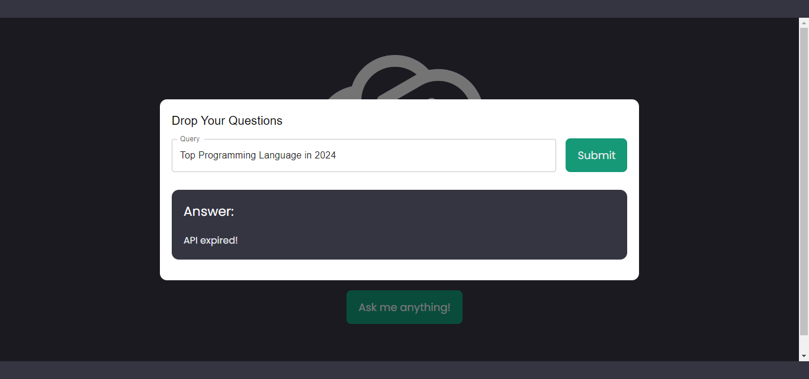

# GPT Web Integration

## Introduction

This repository contains a web application that integrates GPT (Generative Pre-trained Transformer) using the MERN (MongoDB, Express.js, React.js, Node.js) stack along with the OpenAI API. The application allows users to interact with the GPT model through a web interface. This project was my internship task at CodeAlpha.

## Technologies Used

- **MERN Stack**: MongoDB, Express.js, React.js, Node.js
- **Vite**: For client-side build tooling
- **Material UI**: UI components for React.js
- **OpenAI API**: Integration for utilizing the GPT model

## Folder Structure

```
main-folder
├── client
│   ├── [All files that come with Vite project]
└── server
    ├── index.js
    ├── routes
    │   └── chatRoutes.js
    ├── package.json
    └── package-lock.json
```

## Screenshots



## How to Use

1. **Clone the Repository**: 
    ```bash
    git clone https://github.com/hades255/phoboslab-chatgpt-mern.git
    ```

2. **Install Dependencies**: 
    - Open terminal in both the `client` and `server` folders.
    - Run the following command in each folder:
        ```bash
        npm install
        ```

3. **Start Servers**: 
    - Start both servers to run the application.
    - For the client, use:
        ```bash
        npm run dev
        ```
    - For the server, run:
        ```bash
        node index.js
        ```

4. **You're All Set!**: 
    - You can now access the web application and interact with the GPT model.

## License

This project is licensed under the [MIT License](LICENSE).

---

__Developed by__
```
██╗  ██╗ █████╗ ██████╗ ███████╗███████╗
██║  ██║██╔══██╗██╔══██╗██╔════╝██╔════╝
███████║███████║██║  ██║███████╗███████╗
██╔══██║██╔══██║██║  ██║██╔════╝╚════██║
██║  ██║██║  ██║██████╔╝███████╗███████║
╚═╝  ╚═╝╚═╝  ╚═╝╚═════╝ ╚══════╝╚══════╝ 
```